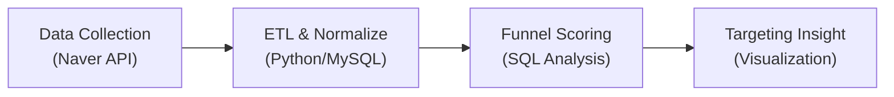
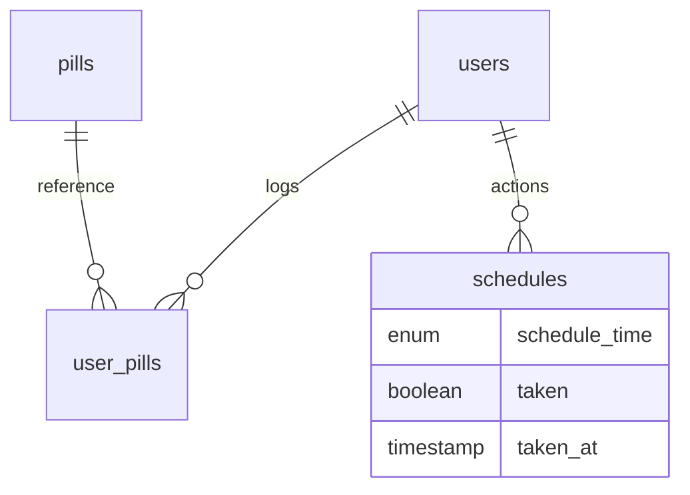

# Hi there, I'm Soyeon Park 👋

  데이터의 흐름을 설계하고, 그 안에서 비즈니스 가치를 발견하는 예비 데이터 분석가 박소연입니다. 
  단순한 수치 확인을 넘어, <b>시장 구조 분석과 타겟팅 전략을 도출</b>하는 데 강점이 있습니다. 
  모바일 앱 개발 경험을 바탕으로 <b>유저 데이터가 생성되는 구조(Schema, Log)에 대한 높은 이해도</b>를 갖추고 있습니다.

 

  📚 <b>Yonsei University Mirae Campus</b>, Dept. of Software (Mar 2022 - Feb 2026) 
  🧪 <b>Undergraduate Research Assistant</b> (Sep 2024 – Aug 2025) 

 

## 🛠️ Tech Stack & Skills

**Data Analysis & Engineering**

  
  
  
  

**Mobile & Web Development**

  
  
  

 

## 🚀 Key Projects for Data Analysis

### 1. Naver Shopping Market Insight Pipeline 🛍️
> **시장/브랜드 분석을 위한 데이터 파이프라인 구축 및 퍼널(Funnel) 스코어링 프로젝트**
> *Role: Data Engineering, SQL Analysis, Insight Reporting*

네이버 쇼핑 API를 활용하여 브랜드/트렌드 키워드 데이터를 수집하고, **SQL 기반 분석을 통해 리서치/제휴/타겟팅 인사이트**를 도출했습니다. 단순 수집을 넘어, 키워드를 퍼널(TOFU/MOFU/BOFU)로 구분하여 마케팅 집중 포인트를 제안하는 로직을 구현했습니다.

**Key Achievements:**
* **Automated Research**: 브랜드/카테고리/트렌드/IP 키워드 데이터 수집 자동화
* **Funnel Analysis**: 검색량과 상품 경쟁도를 기반으로 `Funnel Score`를 산출하여 잠재 시장 발굴
* **Market Intelligence**: 판매처(Mall) 데이터를 정규화하여 시장 내 주요 플레이어(Top Rank Winners) 식별

**Analysis Flow:**

**Insights Example:**
* 특정 IP(캐릭터) 굿즈 시장의 점유율 상위 몰(Store) 분석을 통해 제휴 타겟 리스트 추출
* 키워드별 가격대(Min/Max/Avg) 분포 분석을 통한 포지셔닝 전략 제안

[👉 View Repository](https://github.com/soyeon911/dataanalysis_pro)

 

### 2. Time To Pill (Medication Management App) 💊
> **모바일 서비스 유저 데이터 구조 설계 및 서비스 구축**
> *Role: Full-Stack Dev (React Native, Spring Boot, MySQL)*

직접 모바일 서비스를 기획하고 구축하며, **서비스 내에서 유저 행동 데이터(User Action)와 로그가 어떻게 DB에 적재되는지** 경험했습니다.

**Data Perspective:**
* **Schema Design**: 유저(User) - 약(Pill) - 스케줄(Schedule) 간의 ERD를 설계하여, 유저의 복약 행동 데이터를 구조화
* **Tracking Points**: 회원가입, 검색, 복약 완료 등 주요 이벤트가 발생하는 시점과 데이터 흐름 파악

**Database Schema:**

[👉 View Repository]([https://github.com/soyeon911/time-to-pill](https://github.com/wtaegyu/Time-to-Pill/tree/soyeon))

 

## 📊 GitHub Stats

  
  

## 🧠 Problem Solving

  

